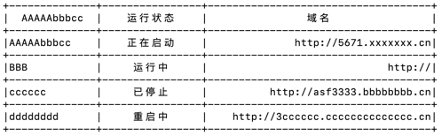

# word-table

> **word-table** is a simple go library for drawing ascii tables in the `terminal` / `console`. 


example:



# 1. Install & Import

> **go get github.com/muzin/word-table**


# 2. Usage & API

See a demo firstly:

```go

// define header
headers := []WordTableHeader{
    WordTableHeader{ 
    	Title: "AAAAAbbbcc",        // 标题
    	TextAlign: Left,            // 文本对齐方式
    	Padding: 2,                 // 内边距
    },
    WordTableHeader{ 
    	Title: "运行状态", 
    	TextAlign: Center, 
    	Padding: 2 
    },
    WordTableHeader{ 
    	Title: "域名", 
    	TextAlign: Right, 
    	Padding: 2 
    },
}

// define body
body := [][]string{
    []string{
        "AAAAAbbbcc", "正在启动", "http://5671.xxxxxxx.cn",
    },
    []string{
        "BBB", "运行中", "http://",
    },
    []string{
        "cccccc", "已停止", "http://asf3333.bbbbbbbb.cn",
    },
    []string{
        "dddddddd", "重启中", "http://3cccccc.cccccccccccccc.cn",
    },
}

wordTable := NewWordTable(headers, body)

// toString
fmt.Println(wordTable.String())

// print
wordTable.Println()

```

Run Result:


# 4. LICENSE

MIT@[muzin](https://github.com/muzin).

